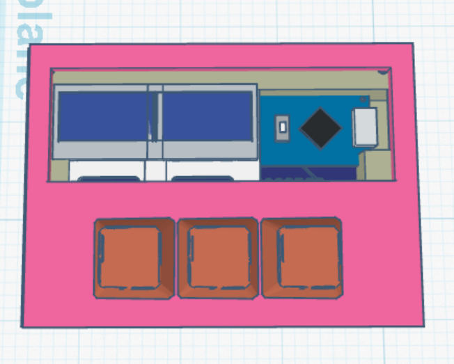
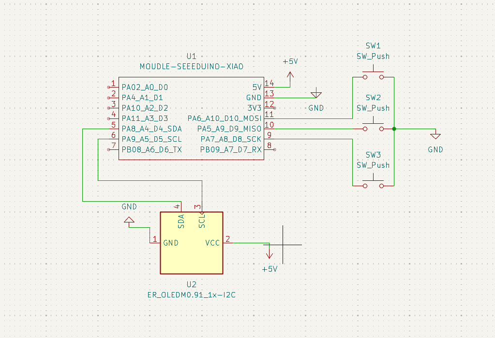
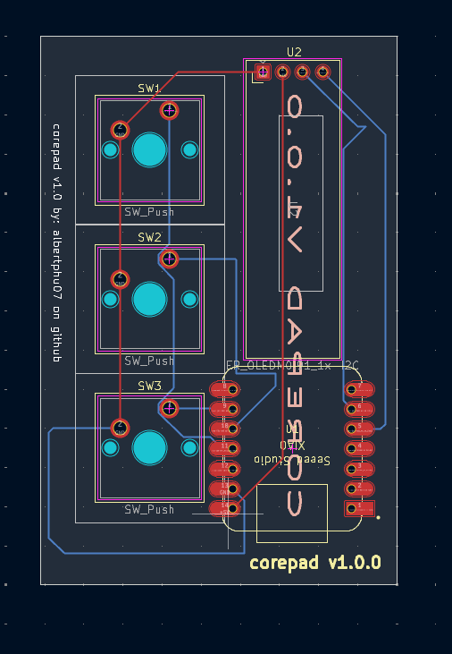

# corepad
The corepad is a  macro pad designed to combine keybinds into s single key. The project runs on the Seeed Studio XIAO RP2040 microcontroller and uses KMK Firmware built with CircuitPython.

## Key Features

* many sperate layers (your choice).
* OLED display to show the active mode.
* Open-source code using KMK, allowing quick modifications without needing to compile firmware.

 ## BOM Of Parts: 

 # 1x Seeed XIAO RP2040
 # 3x MX-Style switches
 # 1x 0.91 inch OLED display
 # 3x white blank DSA keycaps
 # 4x M3x16mm screws
 # 4x M3x5mx4mm heatset inserts
 
