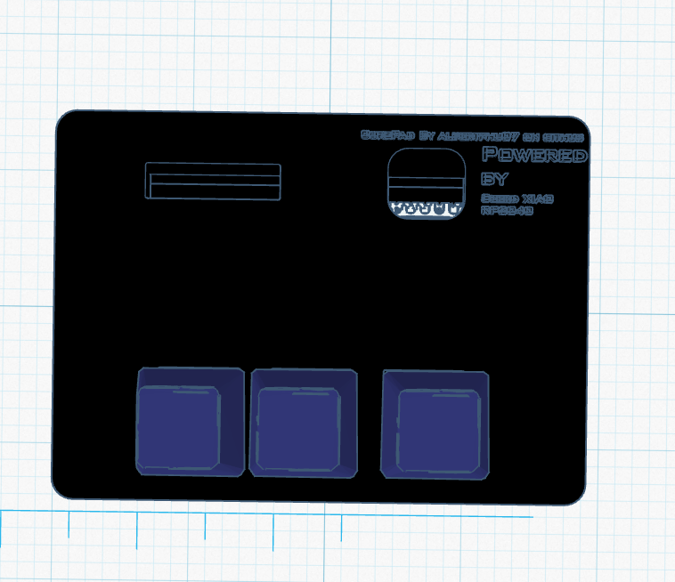
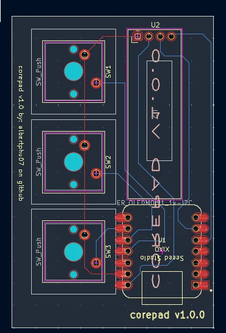

# corepad
The corepad is a  macro pad designed to combine keybinds into s single key. The project runs on the Seeed Studio XIAO RP2040 microcontroller and uses KMK Firmware built with CircuitPython.

## Key Features

* many sperate layers (your choice).
* OLED display to show the active mode.
* Open-source code using KMK, allowing quick modifications without needing to compile firmware.

# Bill of Materials (BOM)

| Qty | Part | Effective Cost |
|------|------|------:|
| 1x | Seeed XIAO RP2040 (un-Soldered) | $10.00 |
| 3x | MX-Style Switches | $0.00 (already owned) |
| 1x | 0.91" OLED Display (1 of 2 included) | ~$4.00 |
| 3x | White Blank DSA Keycaps | $4.59|
| 4x | M3x5mmx4mm Heat-Set Inserts | ~$4.99 |
| 1x | PCB | $6.32 	 | (With shipping (idk how much with customs fees due to tarffis and import from china))
| | **Effective Build Cost** | **~$30.89* |

**Notes**
- All listed parts currently have free shipping (execpt for pcb).
- Keycaps can be substituted with 3D-printed versions to reduce cost.
- PCB will be brought from jlbpcb 
